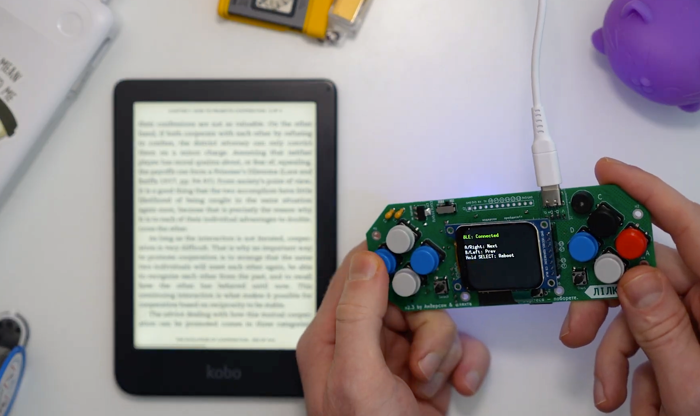
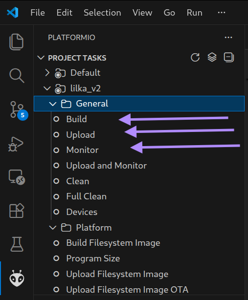

# Lilka BLE Kobo e-reader page turner

A PlatformIO project that builds firmware for a Lilka-based BLE device (ESP32‑S3‑WROOM) intended to interact with Kobo devices. 

This repository contains the PlatformIO project sources, configuration, and supporting libraries.

## Demo


[](https://youtu.be/TLT_gMcJIik)


## What's inside

- `platformio.ini`: PlatformIO configuration and board/environment settings.
- `src/main.cpp`: Main firmware source.
- `include/`: Public header files and project-specific includes.
- `lib/`: Local libraries used by the project.
- `test/`: Test folder (project-specific tests or placeholders).

The last 3 directories are empty in this project.

## Requirements

- PlatformIO (VS Code + PlatformIO extension, or `platformio` CLI)
- A supported toolchain for the target board (configured in `platformio.ini`)

## Build / Upload

Build the firmware with PlatformIO:

```bash
pio run
```

Upload to a connected board:

```bash
pio run -t upload
```

Open the serial monitor:

```bash
pio device monitor
```

Alternatively, use vscode add-on PlatformIO UI:



## Where to look

- Firmware entrypoint: `src/main.cpp`
- Project configuration: `platformio.ini`

## Contributing

Pull requests are welcome. If you open an issue or PR, include the PlatformIO environment you used and steps to reproduce.

## License

This repository includes a `LICENSE` file in the root. Refer to that file for license details.

---